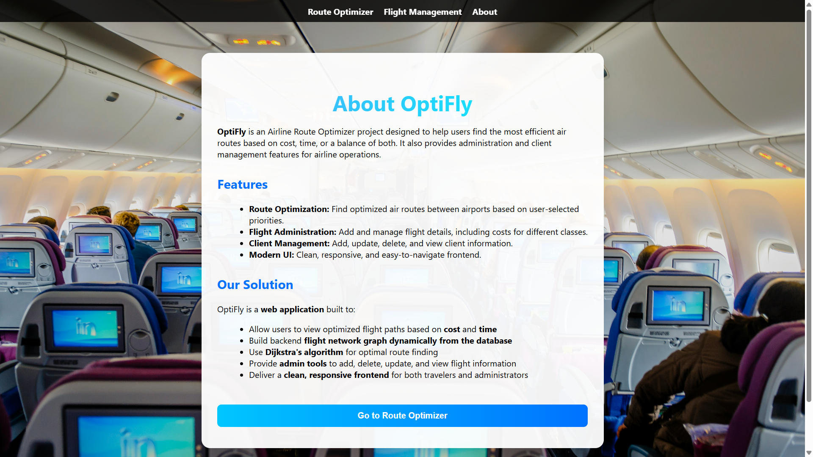
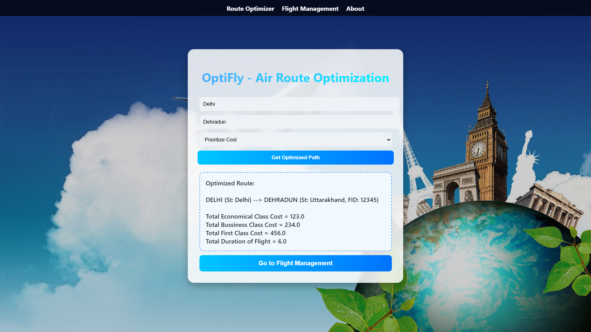
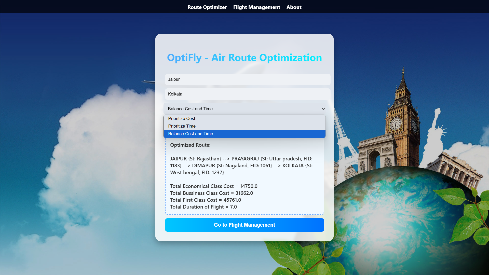

<h1 align="center">✈️ OptiFly — Intelligent Air Route Optimization Platform</h1>

<p align="center">
  <b>OptiFly</b> is a backend-intensive, graph-driven air route optimization system built using <b>Spring Boot</b> that computes the most efficient flight paths based on cost and travel time.
</p>

<p align="center">
  Designed with clean architecture, algorithmic rigor, and real-world scalability in mind.
</p>

<p align="center">
  
  
  
  
  
  
</p>

---

## 📌 Why OptiFly?

Modern flight booking systems often act as **black boxes** — users see the result, but not the logic.
OptiFly was built to **explicitly model flight networks as graphs** and apply **deterministic optimization algorithms**, making routing decisions transparent, testable, and extensible.

This project demonstrates:

* Strong **DSA foundations**
* Clean **layered backend architecture**
* Practical **Spring Boot REST design**
* Real-world **optimization problem solving**

---

## 🧠 Core Concept

The entire air travel network is modeled as a **weighted directed graph**:

* **Nodes** → Airports
* **Edges** → Flights
* **Weights** → Cost / Time

The system dynamically builds this graph and applies **Dijkstra’s Algorithm** to compute the optimal path based on user-defined priority.

---

## ⚙️ What the System Does

- Dynamically constructs a flight network graph
- Computes shortest paths using Dijkstra’s algorithm
- Supports optimization by **cost**, **time**, or extensible hybrid metrics
- Exposes logic via clean REST APIs
- Separates concerns using controller–service–repository layers

---


## 📁 Complete Project Structure

```
OptiFly/
├── 📂 .mvn/                              # ⚙️ Maven wrapper files for consistent builds
│
├── 📂 src/
│   └── 📂 main/
│       ├── 📂 java/
│       │   └── 📂 com/
│       │       └── 📂 optifly/
│       │
│       │           ├── 📂 backend/                   # Core optimization & algorithm engine
│       │           │   ├── 📄 AirPortsCodes.java     # Airport code ↔ name mapping
│       │           │   ├── 📄 ConstructGraph.java    # Builds flight network graph
│       │           │   ├── 📄 OptimisePath.java      # Dijkstra’s algorithm logic
│       │           │   └── 📄 ReturnObject.java      # Optimized route response DTO
│       │
│       │           ├── 📂 controller/                # REST API controllers
│       │           │   ├── 📄 FlightController.java
│       │           │   ├── 📄 RouteOptimizationController.java
│       │           │   └── 📄 HealthCheck.java       # Service health endpoint
│       │
│       │           ├── 📂 entity/                    # Domain models / entities
│       │           │   └── 📄 Flight.java
│       │
│       │           ├── 📂 repository/                 # Data access layer
│       │           │   └── 📄 FlightRepository.java
│       │
│       │           ├── 📂 service/                    # Business logic layer
│       │           │   ├── 📄 FlightService.java
│       │           │   └── 📄 RouteOptimizationService.java
│       │
│       │           └── 📄 OptiFlyApplication.java     # Spring Boot entry point
│       │
│       └── 📂 resources/
│           ├── 📂 static/                 # Static resources (CSS, JS, images if needed)
│           ├── 📂 templates/              # Server-side templates (optional)
│           └── 📄 application.properties  # Application configuration
│
├── 📄 pom.xml                             # Maven dependencies & build config
├── 📄 .gitignore                          # Ignored files & folders
└── 📄 README.md                           # Project documentation

```


<br>

---


## 📸 Preview Images

| 📍 Page / Feature            | 📸 Screenshot                                              |
|:----------------------------|:-----------------------------------------------------------|
| About Page                   |                    |
| Flight Menu Page             |         |
| Add Flight Page              |           |
| Delete Flight Page           |     |
| Update Flight Page           |     |
| View Flights                 |   |
| Path Optimization Result (1) |   |
| Path Optimization Result (2) |   |


<br>

---

## 🔍 Deep Dive: Optimization Engine

### 🔹 Graph Construction

`ConstructGraph.java` converts flight data into an adjacency list representation:

* Ensures fast traversal
* Minimizes memory overhead
* Supports multiple outgoing edges per airport

### 🔹 Path Optimization

`OptimisePath.java` implements **Dijkstra’s Algorithm** using:

* Priority Queue (Min-Heap)
* Distance relaxation
* Path reconstruction

This ensures:

* **O(E log V)** time complexity
* Deterministic shortest path results
* Scalability to large networks

---

## 🌐 API Design

### 🔸 Optimize Flight Route

```http
POST /optimize-route
```

**Request Payload**

```json
{
  "source": "DEL",
  "destination": "BLR",
  "priority": "TIME"
}
```

**Response**

```json
{
  "route": ["DEL", "BOM", "BLR"],
  "totalCost": 5100,
  "totalTime": 5.1
}
```

---

## ▶️ Running the Project

### ✅ Prerequisites

* Java 17+
* Maven
* IntelliJ IDEA (recommended)

### 🚀 Run Locally

```bash
mvn spring-boot:run
```

Or simply run:

```
OptiFlyApplication.java ▶️
```

The application starts on:

```
http://localhost:8080
```

---

## 🧪 Testing & Extensibility

* Designed for unit testing at service and algorithm levels
* Easy to plug in:

  * Real databases
  * External flight APIs
  * Multi-criteria optimization strategies

---

## 🚀 Future Roadmap

* 🔐 JWT authentication & role-based access
* 📊 Multi-objective optimization (Pareto optimal paths)
* 🌍 Real-time flight data integration
* 🧠 Heuristic / A* based routing
* 📱 Frontend or mobile client

---

## 📞 Help & Contact  

> 💬 *Got a question, suggestion, or need help with Optifly?*  
> We’re here to assist and collaborate!

<div align="center">

<b>👤 Abhay Kanojia</b>  
<a href="https://www.linkedin.com/in/abhay-kanojia-0461a3341">
  
</a>  

<br/>

<b>👤 Anvesha Rawat</b>  
<a href="https://www.linkedin.com/in/anvesha-rawat-b9a1a0308?utm_source=share&utm_campaign=share_via&utm_content=profile&utm_medium=android_app">
  
</a>


<br>

---
